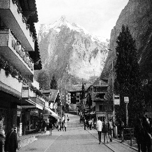
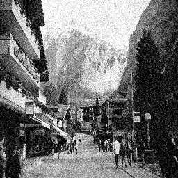
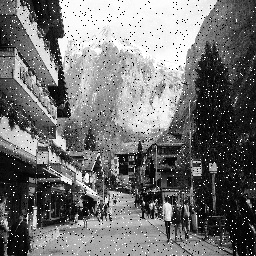

# Görüntü İşleme Dersi - Ödev 1

# 1. Görüntü Okuma ve Görüntüleme:

Bu proje, OpenCV kütüphanesi kullanılarak basit bir görüntü okuma ve gösterme uygulamasını içerir.

## Özellikler

- Resim dosyasını okuma
- Resmi ekranda gösterme
- Görüntü boyutlarını ve veri tipini gösterme

## Örnek Çıktı


Programın çalıştırılması sonucu:
- Görüntü boyutu: (yükseklik, genişlik, kanal)
- Veri tipi: uint8

## Gereksinimler

Projeyi çalıştırmak için aşağıdaki kütüphanelerin yüklü olması gerekir:

1. OpenCV

```bash
pip install opencv-python
```

2. Matplotlib

```bash
pip install matplotlib
```

## Kullanım

1. Resim dosyanızı proje klasörüne koyun
2. Kodu çalıştırın:

```bash
python odev-1.py
```
3. Resim penceresi açılacaktır
4. Kapatmak için herhangi bir tuşa basın

## Kod Açıklaması

- `cv2.imread()`: Resim dosyasını okur
- `cv2.imshow()`: Resmi bir pencerede gösterir
- `image.shape`: Görüntünün boyutlarını verir (yükseklik, genişlik, kanal sayısı)
- `image.dtype`: Görüntü verilerinin tipini gösterir


# 2. Gri Tonlamalı Görüntüye Dönüştürme:

Bu projede renkli resimleri gri tonlamalı resimlere dönüştürüyoruz. Gri tonlamalı görüntünü boyutlarını kontrol edip neden kanal sayısının değiştiğini açıklıyoruz.

## Renkli resim ve gri tonlamalı resim:

### Renkli Resim:


### Gri Tonlamalı Resim:


## Kod Açıklaması:

-`cv2.cvtColor()`: Gri tonlamalı görüntüye dönüştürür


-`cv2.imwrite()`:  Görüntüyü kaydeder


-`plt.figure(figsize=(10,5))`: Çizim alanının boyutunu belirler. genişlik=10 inç, yükseklik=5 inç


-`plt.subplot(1, 2, 1)`: sıra numarasını belirler. 1: satır sayısı, 2: sütun sayısı, 1: bu plot'un sıra numarası


-`plt.title('BASLIK')`: Başlığı belirler.


-`plt.axis('off')`: Eksenlerdeki sayıları ve çizgileri gizler.


-`plt.tight_layout()`: Resimlerin ve başlıkların birbirine girmesini önlüyoruz.


-`plt.show()`: Resimleri ekranda gösterir.


## Kullanım:

```bash
python odev-2.py
```

## Neden Kanal Sayısı Değişir? (Ders notlarından alınmıştır.)

Görüntüler aslında matrisler olarak temsil edilir. Siyah-beyaz 
(grayscale) görüntüler tek kanallı matrislerdir; renkli (RGB) görüntüler 
ise üç kanallı matrislerdir (Kırmızı, Yeşil, Mavi).Örneğin, 200x300 
piksellik bir grayscale görüntü, numpy dizisi olarak şöyle temsil edilir:

```bash
import numpy as np
image = np.random.randint(0, 256, (200, 300), dtype=np.uint8)  # 0-255 arasında rastgele pikseller
print(image.shape)  # (200, 300)
```

Renkli bir görüntü (RGB) ise 3 boyutlu bir dizi ile ifade edilir:

```bash
color_image = np.random.randint(0, 256, (200, 300, 3), dtype=np.uint8)
print(color_image.shape)  # (200, 300, 3)
```

## Kişisel Yorum (Analiz):

### RGB Resimler:
     3 kanaldan oluşur: Kırmızı (Red), Yeşil (Green) ve Mavi (Blue).
     Her piksel, bu üç kanalın birleşimiyle temsil edilir.
     Örneğin, bir pikselin değeri (R, G, B) şeklindedir (örneğin, (255, 0, 0) tamamen kırmızıyı temsil eder).

### Gri Tonlamalı Resimler:
     1 kanaldan oluşur: Parlaklık (Intensity).
     Her piksel, yalnızca bir parlaklık değeriyle temsil edilir (0: siyah, 255: beyaz).
     Örneğin, bir pikselin değeri 128 gibi tek bir sayıdır (orta griyi temsil eder).

### Kanal Sayısının Değişme Nedeni
     RGB resimde her piksel 3 değerle (R, G, B) temsil edilirken, gri tonlamalı resimde her piksel yalnızca 1 değerle (parlaklık) temsil edilir.
     Bu nedenle, gri tonlamalı resimde kanal sayısı 3'ten 1'e düşer.

### Bellek ve İşlem Optimizasyonu:
     Gri tonlamalı resimler, RGB resimlere göre 3 kat daha az bellek kullanır.
     Bu, özellikle büyük veri setleri üzerinde çalışırken performans avantajı sağlar.


# 3. Görüntü Parlaklığını Artırma:

Bu projede gri tonlamalı bir görüntünün parlaklığını artırıyoruz ve sonuçları görselleştiriyoruz.

## Orijinal ve Parlaklığı Artırılmış Görüntü:

### Orijinal Gri Görüntü:


### Parlaklığı Artırılmış Görüntü:


## Kod Açıklaması:

- `np.clip()`: Piksel değerlerini 0-255 arasında sınırlar
- `brightness_value`: Parlaklık artırma miktarı (0-255 arası)
- Formül: Yeni Piksel Değeri = Orijinal Değer + Parlaklık Değeri

## Parlaklık Artırmanın Etkileri:

### Piksel Değişimleri:
- Orijinal piksel değerine parlaklık değeri eklenir
- Sonuç 255'i geçerse, 255'te sınırlandırılır
- Örnek: 150 + 50 = 200, 220 + 50 = 255 (270 yerine)

### Görsel Etkiler:
- Koyu gri tonları daha açık gri olur
- Açık gri tonları beyaza yaklaşır
- Çok açık bölgeler beyazda doygunluğa ulaşabilir

### Avantajlar:
- Basit ve hızlı bir işlem
- Düşük ışıklı bölgeleri görünür hale getirir
- Kolay uygulanabilir

### Dezavantajlar:
- Aşırı parlaklık detay kaybına neden olabilir
- Kontrast azalabilir
- Doğal görünüm bozulabilir

## Kullanım:

```bash
python odev-3.py
```

## Kişisel Yorum (Analiz):

### Parlaklık Artırma İşlemi:
- Piksel değerlerine sabit bir değer eklenir
- Sonuçlar 0-255 arasında sınırlandırılır
- Doğrusal bir dönüşümdür

### Uygulama Alanları:
- Düşük ışıklı görüntüleri iyileştirme
- Görüntü ön işleme
- Detayları daha görünür hale getirme

### Dikkat Edilmesi Gerekenler:
- Parlaklık değeri çok yüksek seçilmemeli
- Detay kaybı göz önünde bulundurulmalı
- Görüntünün amacına uygun değer seçilmeli


# 4. Görüntü Kontrastını Artırma:

Bu projede gri tonlamalı bir görüntünün kontrastını artırıyoruz ve sonuçları görselleştiriyoruz.

## Orijinal ve Kontrastı Artırılmış Görüntü:

### Orijinal Gri Görüntü:


### Kontrastı Artırılmış Görüntü:


## Kod Açıklaması:

- `contrast_factor`: Kontrast artırma çarpanı (1'den büyük değerler)
- Formül: Yeni Piksel Değeri = Orijinal Değer × Kontrast Faktörü
- İşlem adımları:
  1. Görüntü float32 tipine dönüştürülür
  2. Her piksel kontrast faktörü ile çarpılır
  3. Sonuçlar 0-255 arasında sınırlandırılır
  4. Görüntü uint8 tipine geri dönüştürülür

## Kontrast Artırmanın Etkileri:

### Piksel Değişimleri:
- Orijinal piksel değeri kontrast faktörü ile çarpılır
- Örnek (contrast_factor = 1.5):
  - 100 → 150 (100 × 1.5)
  - 200 → 255 (200 × 1.5 = 300, ama 255'te sınırlandı)
  - 50 → 75 (50 × 1.5)

### Görsel Etkiler:
- Açık ve koyu bölgeler arasındaki fark artar
- Detaylar daha belirgin hale gelir
- Çok açık ve çok koyu bölgelerde detay kaybı olabilir

### Avantajlar:
- Görüntüdeki detaylar daha belirgin hale gelir
- Nesneler arası ayrım netleşir
- Görüntü daha canlı görünür

### Dezavantajlar:
- Aşırı kontrast detay kaybına neden olabilir
- Çok açık ve çok koyu bölgelerde bilgi kaybı
- Doğal görünüm bozulabilir

## Kullanım:

```bash
python odev-4.py
```

## Kişisel Yorum (Analiz):

### Kontrast Artırma İşlemi:
- Piksel değerleri bir katsayı ile çarpılır
- İşlem doğrusal bir dönüşümdür
- Taşma kontrolü önemlidir

### Uygulama Alanları:
- Medikal görüntüleme
- Nesne tespiti
- Görüntü iyileştirme

### Dikkat Edilmesi Gerekenler:
- Kontrast faktörü dikkatli seçilmeli
- Veri kaybı göz önünde bulundurulmalı
- Görüntünün amacına uygun değer kullanılmalı


# 5. Piksel Tabanlı ve Komşuluk Tabanlı İşlemler Karşılaştırması:

Bu bölümde piksel tabanlı ve komşuluk tabanlı görüntü işleme yöntemlerinin karşılaştırmalı analizini yapıyoruz.

## Temel Farklar:

### 1. Piksel Tabanlı İşlemler (Point Processing):

- **Tanım**: Her piksel yalnızca kendi değerine göre işlenir
- **Matematiksel İfade**: Iout(x,y) = f(Iin(x,y))
- **Örnekler**:
  - Parlaklık ayarı
  - Kontrast germe
  - Eşikleme (thresholding)
  - Negatif alma
  - Histogram eşitleme

### 2. Komşuluk Tabanlı İşlemler (Neighborhood Processing):

- **Tanım**: Her piksel, kendisi ve komşularının değerlerine göre işlenir
- **Matematiksel İfade**: Iout(x,y) = f(Iin(x±i, y±j)), i,j ∈ pencere boyutu
- **Örnekler**:
  - Yumuşatma (smoothing)
  - Keskinleştirme (sharpening)
  - Kenar tespiti (edge detection)
  - Gürültü azaltma
  - Medyan filtresi

## Karşılaştırma Tablosu:

| Özellik | Piksel Tabanlı İşlemler | Komşuluk Tabanlı İşlemler |
|---------|-------------------------|---------------------------|
| Etki Alanı | Tek piksel | Piksel ve komşuları |
| Kullanılan Veri | Yalnızca mevcut piksel | Bir filtre (kernel) ile işlem |
| Hız | Hızlı | Nispeten yavaş |
| Karmaşıklık | Düşük | Yüksek (filtre boyutuna bağlı) |
| Uygulama Örnekleri | Parlaklık ayarı, eşikleme | Bulanıklaştırma, kenar tespiti |
| İşlem Yöntemi | Doğrudan piksel değeri üzerinde | Komşu piksellerin analizi ile |
| Hesaplama Yükü | O(n) | O(n*m), m: filtre boyutu |
| Bellek Kullanımı | Düşük | Yüksek (filtre boyutuna bağlı) |
| Gürültü Azaltma | Etkisiz | Etkili |
| Kenar Koruma | Yetersiz | İyi |

## Uygulama Örnekleri:

### Piksel Tabanlı:
```python
# Parlaklık artırma
I_out = I_in + c

# Kontrast artırma
I_out = a * I_in + b

# Eşikleme
I_out = 255 if I_in > T else 0
```

### Komşuluk Tabanlı:
```python
# Gaussian blur (3x3 kernel)
# Sobel operatörü (3x3 kernel)
# Medyan filtre (NxN pencere)
```

## Seçim Kriterleri:

### Piksel Tabanlı Tercih:
- Hız önemli ise
- Basit görüntü iyileştirme
- Gerçek zamanlı uygulamalar
- Sınırlı hesaplama gücü

### Komşuluk Tabanlı Tercih:
- Kalite önemli ise
- Gürültü azaltma gerekli
- Kenar tespiti/koruma önemli
- Detaylı analiz gerekli

## Kullanım:

```bash
python odev-5.py
```

# 6. Görüntü Gürültüleri ve Özellikleri:

Bu bölümde farklı görüntü gürültü türlerini ve özelliklerini inceliyoruz.

## Gürültü Türleri:

### 1. Gauss (Normal) Gürültüsü:
- En yaygın gürültü türü
- Elektronik sistemlerde termal kaynaklı
- Her piksel değerine sürekli değerler eklenir
- Parametreleri:
  - Ortalama (genelde 0)
  - Standart Sapma (sigma)
- Özellikle düşük kaliteli sensörlerde belirgin
- Temizleme yöntemleri:
  - Gauss filtresi
  - Wiener filtresi
  - Ortalama filtre

### 2. Tuz-Biber Gürültüsü:
- Anlık piksel hataları (beyaz=tuz, siyah=biber)
- Sensör arızaları veya dijital iletim hatalarından kaynaklanır
- Gürültü yoğunluğu 'prob' parametresiyle kontrol edilir
- Kenarları bozma eğilimindedir
- Özellikle eski görüntüleme sistemlerinde yaygın
- Temizleme yöntemleri:
  - Medyan filtresi
  - Morfolojik filtreler
  - Non-local means

### 3. Poisson (Shot) Gürültüsü:
- Foton istatistiklerinden kaynaklanan kuantum gürültüsü
- Parlak piksellerde daha belirgin (ışığa bağımlı)
- Özellikle düşük ışıklı tıbbi/astronomik görüntülerde görülür
- Gürültü miktarı görüntü yoğunluğuyla doğru orantılı
- Temizleme yöntemleri:
  - Anscombe dönüşümü
  - Wavelet temizleme
  - BM3D algoritması

## Karşılaştırma Tablosu:

| Gürültü Türü | Dağılım | Python Üretme Kodu | Temel Özellikler | Uygun Temizleme Yöntemleri |
|--------------|---------|-------------------|------------------|---------------------------|
| Gauss | Normal Dağılım | np.random.normal() | Tüm pikselleri etkiler | Gauss/Wiener/Ortalama filtre |
| Tuz-Biber | Ayrık (0 ve 255) | Rastgele siyah/beyaz | Anlık piksel bozulmaları | Medyan/Morfolojik filtreler |
| Poisson | Poisson Dağılımı | np.random.poisson() | Parlaklığa bağımlı | Anscombe/Wavelet/BM3D |

## Kullanım:

```bash
python odev-6.py
```

## Örnek Görüntüler:

<table>
  <tr>
    <td></td>
    <td></td>
    <td></td>
    <td></td>
  </tr>
  <tr>
    <td align="center">Orijinal</td>
    <td align="center">Gauss Gürültüsü</td>
    <td align="center">Tuz-Biber Gürültüsü</td>
    <td align="center">Poisson Gürültüsü</td>
  </tr>
</table>

## Kişisel Yorum (Analiz):

### Gürültü Seçimi:
- Gauss: Genel amaçlı test ve simülasyonlar için
- Tuz-Biber: Sensör/iletim hatalarını test için
- Poisson: Düşük ışık koşullarını simüle etmek için

### Uygulama Alanları:
- Görüntü işleme algoritmalarının test edilmesi
- Gürültü giderme yöntemlerinin değerlendirilmesi
- Gerçek dünya koşullarının simülasyonu

### Dikkat Edilmesi Gerekenler:
- Gürültü parametrelerinin gerçekçi seçilmesi
- Görüntünün amacına uygun gürültü türü seçimi
- Temizleme yönteminin gürültü türüne uygunluğu

